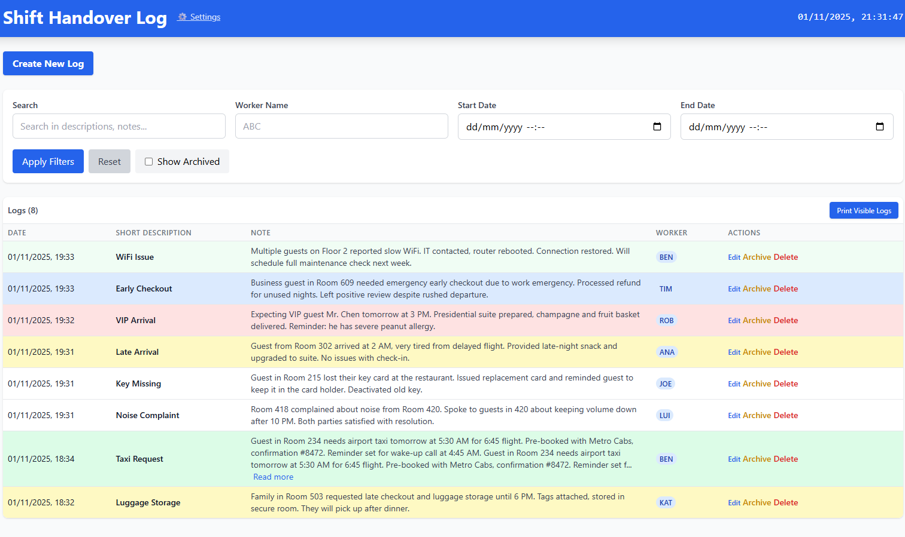
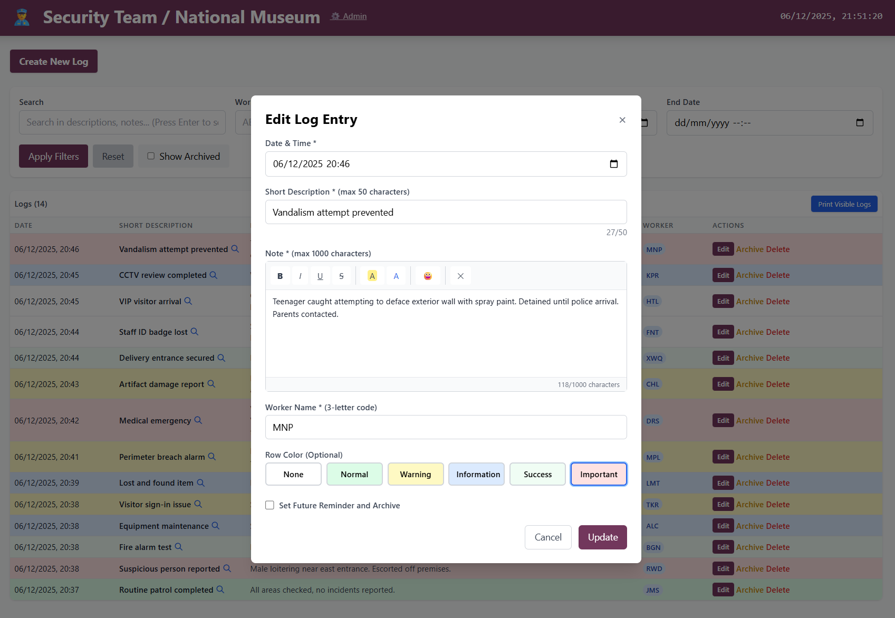

# 🔄 Shift Handover Log

> **Modern shift handover solution for shift-based teams**  
> Document, manage, and communicate critical shift information with searchable, color-coded logs and real-time info slides. Perfect for hotel operations, security teams, reception desks, and any organization working in shifts.

  

---

## 📸 Overview



**Shift Handover Log** is a comprehensive web application designed to streamline communication between shifts. With an intuitive interface, powerful search capabilities, and real-time information displays, it ensures that critical information is never lost in transition.

### 🎯 Perfect For

- 🏨 **Hotel Operations** - Front desk, housekeeping, maintenance teams
- 🛡️ **Security Teams** - Incident reporting and shift transitions
- 🏢 **Reception Desks** - Customer service and administrative teams
- 🏭 **Manufacturing** - Production line handovers
- 🚑 **Healthcare** - Patient care transitions
- *Any team working in shifts*

---

## ⚠️ Project Status

**Alpha v0.25.11-alpha.6** - This project is in early development and is **NOT ready for production use**.

- ⚠️ Use at your own risk
- ⚠️ Features may be incomplete or unstable
- ⚠️ Regular backups recommended
- ⚠️ Default admin password must be changed immediately

---

## ✨ Key Features

### 📝 Log Management

- **Create & Edit** - Easily create new log entries with rich text formatting
- **Search & Filter** - Find logs by date, worker, or keywords instantly
- **Color Coding** - Visual priority system (green, yellow, blue, red)
- **Archive System** - Keep your active logs clean while preserving history
- **Expanded View** - Detailed log view with smooth navigation
- **Print Support** - Export visible logs with custom formatting
- **Pagination** - Navigate through large log collections effortlessly

### 📊 Information Display

- **Real-time Clock** - Always know the current time
- **Permanent Info Slide** - Access critical information with one click
- **@Mentions** - Highlight team members in notes (excludes email addresses)
- **Rich Text Editor** - Full formatting support (bold, italic, underline, strikethrough, colors, emojis)
- **WYSIWYG Editing** - What you see is what you get
- **Compact Table View** - Efficient overview with expandable details



### ⚙️ Admin Controls

- **Secure Authentication** - Password-protected admin access with configurable session expiry
- **User Management** - Add, edit, delete, and reorder users with email support
- **Role-Based Access** - Assign users as Admin or Normal User
- **Password Email** - Send credentials via email (SMTP configuration required)
- **Customizable Page Title** - Brand your application
- **Permanent Information Editor** - Manage info slides with rich text
- **Password Management** - Secure password change on first login
- **Login Expiry Settings** - Configure session duration (1-168 hours) with enable/disable toggle
- **Real-time Updates** - Changes take effect immediately
- **Admin Protection** - Admin user cannot be deleted or renamed

### 🎨 User Experience

- **Responsive Design** - Works seamlessly on desktop, tablet, and mobile
- **Intuitive Interface** - Clean, modern design that requires no training
- **Fast Performance** - Instant search and filtering
- **Visual Feedback** - Flash animations for updated entries
- **Keyboard Navigation** - Power user shortcuts

---

## 🚀 Quick Start

### 📦 Automatic Proxmox Installation (Recommended)

Easily install the application on your Proxmox server with a single command. This script sets up an LXC container, installs Docker, and deploys the application automatically.

**How to install:**
1. Open your Proxmox Shell (Host)
2. Run the following command:
   ```bash
   curl -sSL https://raw.githubusercontent.com/tabasko81/Handover/main/install-proxmox.sh | bash
   ```
3. Follow the on-screen instructions.

👉 **See detailed guide:** [PROXMOX-SETUP.md](PROXMOX-SETUP.md)

**New to Proxmox? Check these tutorials:**
- 📺 [How to Install Proxmox VE 8](https://www.youtube.com/watch?v=5j0l5kE8Wjg)
- 📺 [Proxmox Beginners Guide](https://www.youtube.com/watch?v=AZtJ9s0vDXw)

---

### Using Docker (Manual)

**For Windows Users (Non-Technical):**  
👉 See **[docs/INSTALL_GUIDE_WINDOWS.md](docs/INSTALL_GUIDE_WINDOWS.md)** for a complete step-by-step guide with screenshots and troubleshooting.

**For Technical Users:**

1. Ensure Docker Desktop is running
2. Execute `docker-start.bat` (Windows) or `docker-compose up -d --build`
3. Open http://localhost:3000 in your browser

### Local Installation (Windows)

1. Install **Node.js 14+** if not already installed
2. Run `install.bat` to install dependencies
3. Run `setup-db.bat` to initialize the database
4. Run `start.bat` to launch the application
5. Access http://localhost:3000 in your browser

---

## 📖 Usage Guide


👉 **Complete Documentation:** See **[docs/USER_MANUAL.md](docs/USER_MANUAL.md)** for comprehensive feature documentation.

### Quick Reference

| Action | How To |
|--------|--------|
| **Create Log** | Click "Create New Log" button |
| **Edit Log** | Click "Edit" on any log entry, or use the 🔍 magnifying glass icon |
| **Archive** | Click "Archive" to archive, "Restore" to restore |
| **Search** | Use the search box and filters at the top |
| **Info Slide** | Click the (i) button on the left side |
| **Expanded View** | Click the 🔍 icon next to any short description |
| **Print** | Click "Print Visible Logs" - title shows "Page Name YYYY.MM.DD" |
| **Navigate Logs** | Use keyboard arrows or side buttons in expanded view |

---

## 🔐 Admin Access & Settings

### First-Time Setup

1. Click the **"⚙️ Admin"** link in the header
2. Login with default credentials:
   - **Username:** `admin`
   - **Password:** `pass123`
3. **⚠️ IMPORTANT:** Change the password immediately on first login

### Available Settings

- **Page Name** - Customize the application title displayed in the header
- **Permanent Information** - Edit information shown in the info slide (accessible via the (i) button)
- **Login Expiry** - Enable/disable login session expiry and configure duration (1-168 hours)

All changes take effect immediately after saving.

---

## 🛠️ Troubleshooting

### Common Issues

| Issue | Solution |
|-------|----------|
| **Application won't start** | Verify Docker is running (Docker) or Node.js is installed (Local) |
| **Backend errors** | Check that port 5000 is available and backend server is running |
| **Database errors** | Verify `data/shift_logs.db` exists and is accessible |
| **Frontend not loading** | Ensure port 3000 is free and frontend server is running |
| **Search not working** | Check browser console for JavaScript errors |

### Getting Help

1. Check the browser console (F12) for error messages
2. Verify all services are running (backend on port 5000, frontend on port 3000)
3. Restart both frontend and backend servers
4. Review [docs/TROUBLESHOOTING.md](docs/TROUBLESHOOTING.md) for detailed solutions

---

## 📚 Documentation

- **[User Manual](docs/USER_MANUAL.md)** - Complete feature documentation
- **[Quick Start Guide](docs/QUICKSTART.md)** - Fast installation guide
- **[Docker Guide](docs/DOCKER.md)** - Docker-specific instructions
- **[Windows Installation](docs/INSTALL_GUIDE_WINDOWS.md)** - Step-by-step Windows guide
- **[Network Access](docs/HOWTO_NETWORK_ACCESS.md)** - Configure network access
- **[Troubleshooting](docs/TROUBLESHOOTING.md)** - Common issues and solutions

---

## 📄 License

**ISC License**

---

## 👤 Author

**Miguel da Silva**

---

## 🙏 Acknowledgments

Built with modern web technologies to provide a seamless shift handover experience for teams worldwide.

---

**⭐ If you find this project useful, consider giving it a star!**
