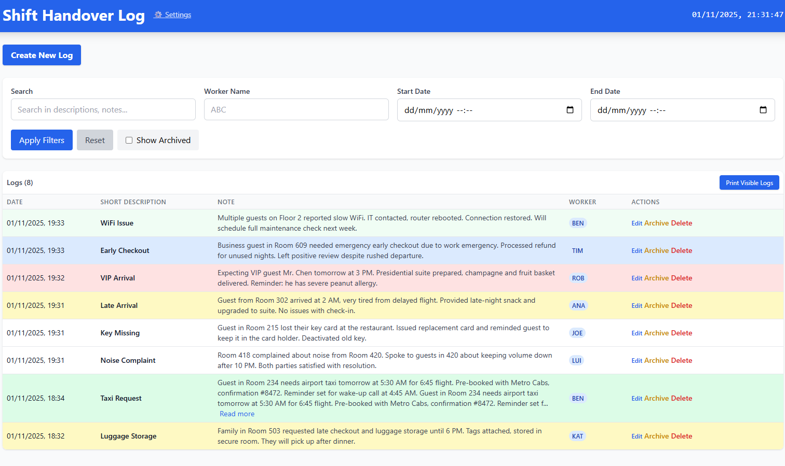
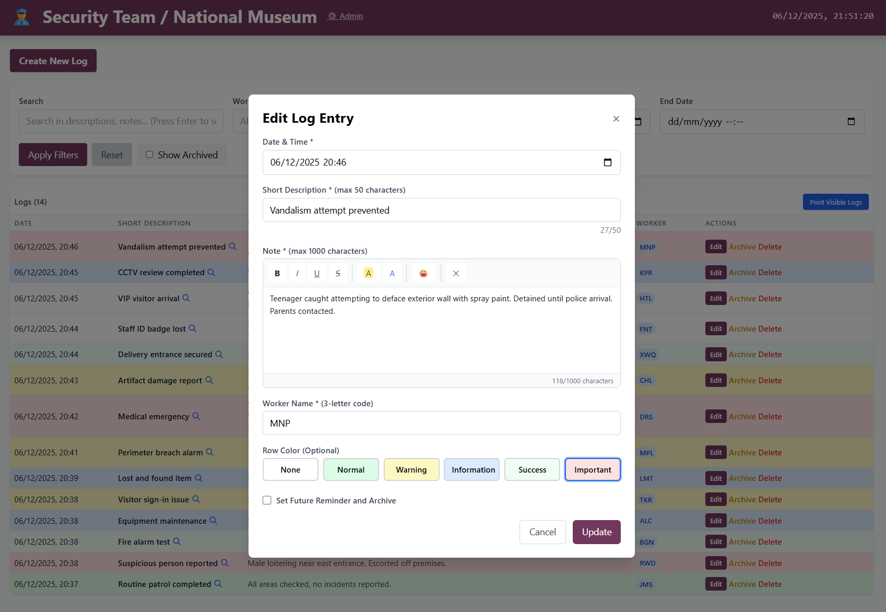
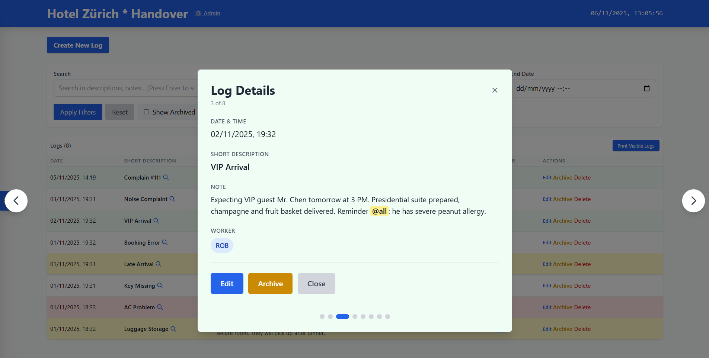

# 🔄 Shift Handover Log

> **Modern shift handover solution for shift-based teams**  
> Document, manage, and communicate critical shift information with searchable, color-coded logs and real-time info slides. Perfect for hotel operations, security teams, reception desks, and any organization working in shifts.

  

---

## 📸 Overview

**Shift Handover Log** is a comprehensive web application designed to streamline communication between shifts. With an intuitive interface, powerful search capabilities, and real-time information displays, it ensures that critical information is never lost in transition.

### 🎯 Perfect For

- 🏨 **Hotel Operations** - Front desk, housekeeping, maintenance teams
- 🛡️ **Security Teams** - Incident reporting and shift transitions
- 🏢 **Reception Desks** - Customer service and administrative teams
- 🏭 **Manufacturing** - Production line handovers
- 🚑 **Healthcare** - Patient care transitions
- *Any team working in shifts*

---

## ⚠️ Project Status

**Alpha v0.26.03-Alpha.2** - This project is in alpha testing phase.

- ⚠️ Use at your own risk
- ⚠️ Features may be incomplete or unstable
- ⚠️ Regular backups recommended
- ⚠️ Default admin password must be changed immediately

---

## ✨ Key Features

### 📝 Log Management

- **Create & Edit** - Easily create new log entries with rich text formatting
- **Search & Filter** - Find logs by date, worker, or keywords instantly
- **Color Coding** - Visual priority system (green, yellow, blue, red)
- **Archive System** - Keep your active logs clean while preserving history
- **Expanded View** - Detailed log view with smooth navigation
- **Print Support** - Export visible logs with custom formatting
- **Pagination** - Navigate through large log collections effortlessly

### 📊 Information Display

- **Real-time Clock** - Always know the current time
- **Permanent Info Slide** - Access critical information with one click
- **@Mentions** - Highlight team members in notes (excludes email addresses)
- **Rich Text Editor** - Full formatting support (bold, italic, underline, strikethrough, colors, emojis)
- **WYSIWYG Editing** - What you see is what you get
- **Compact Table View** - Efficient overview with expandable details

### ⚙️ Admin Controls

- **Secure Authentication** - Password-protected admin access with configurable session expiry
- **User Management** - Add, edit, delete, and reorder users with email support
- **Role-Based Access** - Assign users as Admin or Normal User
- **Password Email** - Send credentials via email (SMTP configuration required)
- **Customizable Page Title** - Brand your application
- **Permanent Information Editor** - Manage info slides with rich text
- **Password Management** - Secure password change on first login
- **Login Expiry Settings** - Configure session duration (1-168 hours) with enable/disable toggle
- **Real-time Updates** - Changes take effect immediately
- **Admin Protection** - Admin user cannot be deleted or renamed

### 🎨 User Experience

- **Responsive Design** - Works seamlessly on desktop, tablet, and mobile
- **Intuitive Interface** - Clean, modern design that requires no training
- **Fast Performance** - Instant search and filtering
- **Visual Feedback** - Flash animations for updated entries
- **Keyboard Navigation** - Power user shortcuts

---

## 🚀 Quick Start

### ⚡ Standalone Installation (Python Launcher) - **RECOMMENDED FOR TESTING**

The easiest way to get started! No installation required - just run the executable.

1. **Download the `dist` folder** (pre-compiled distribution)
2. **Double-click `HandoverServer.exe`**
3. **Click "Start Server"**
4. **Open http://localhost:8500** in your browser

👉 **See detailed guide:** [INSTALL_GUIDE_DIST.md](INSTALL_GUIDE_DIST.md)

---

### Local Installation (Windows)

1. **Node.js 14+** required. If not installed:
   - Option A: Install from [nodejs.org](https://nodejs.org/)
   - Option B: Run `.\setup-portable-nodejs.ps1` to download portable Node.js to `dist/nodejs`
2. Run `.\install.bat` to install dependencies (use `.\` prefix in PowerShell)
3. Run `.\setup-db.bat` to initialize the database
4. Run `.\start.bat` to launch the application
5. Access http://localhost:3000 in your browser (dev mode)

---

## 📖 Usage Guide

👉 **Complete Documentation:** See **[docs/USER_MANUAL.md](docs/USER_MANUAL.md)** for comprehensive feature documentation.

### Quick Reference

| Action | How To |
|--------|--------|
| **Create Log** | Click "Create New Log" button |
| **Edit Log** | Click "Edit" on any log entry, or use the 🔍 magnifying glass icon |
| **Archive** | Click "Archive" to archive, "Restore" to restore |
| **Search** | Use the search box and filters at the top |
| **Info Slide** | Click the (i) button on the left side |
| **Expanded View** | Click the 🔍 icon next to any short description |
| **Print** | Click "Print Visible Logs" - title shows "Page Name YYYY.MM.DD" |
| **Navigate Logs** | Use keyboard arrows or side buttons in expanded view |

---

## 🔐 Admin Access & Settings

### First-Time Setup

1. Click the **"⚙️ Admin"** link in the header
2. Login with default credentials:
   - **Username:** `admin`
   - **Password:** `pass123`
3. **⚠️ IMPORTANT:** Change the password immediately on first login

### Available Settings

- **Page Name** - Customize the application title displayed in the header
- **Permanent Information** - Edit information shown in the info slide (accessible via the (i) button)
- **Login Expiry** - Enable/disable login session expiry and configure duration (1-168 hours)

All changes take effect immediately after saving.

---

## 🛠️ Troubleshooting

### Common Issues

| Issue | Solution |
|-------|----------|
| **Application won't start** | Verify Node.js is installed (Local) or use Standalone executable |
| **Backend errors** | Check that port 8500 is available and backend server is running |
| **Database errors** | Verify `data/shift_logs.db` exists and is accessible |
| **Frontend not loading** | Ensure port 8500 is free and server is running |
| **Search not working** | Check browser console for JavaScript errors |

### Getting Help

1. Check the browser console (F12) for error messages
2. Verify server is running (port 8500)
3. Restart the server
4. Review [docs/TROUBLESHOOTING.md](docs/TROUBLESHOOTING.md) for detailed solutions

---

## 📚 Documentation

- **[User Manual](docs/USER_MANUAL.md)** - Complete feature documentation
- **[Quick Start Guide](docs/QUICKSTART.md)** - Fast installation guide
- **[Standalone Installation](INSTALL_GUIDE_DIST.md)** - Complete guide for dist folder
- **[Network Access](docs/HOWTO_NETWORK_ACCESS.md)** - Configure network access
- **[Troubleshooting](docs/TROUBLESHOOTING.md)** - Common issues and solutions

---

## 📄 License

This project is licensed under the MIT License - see the [LICENSE](LICENSE) file for details.

---

## 👤 Author

**Miguel da Silva**

---

## 🙏 Acknowledgments

Built with modern web technologies to provide a seamless shift handover experience for teams worldwide.

---

**⭐ If you find this project useful, consider giving it a star!**
